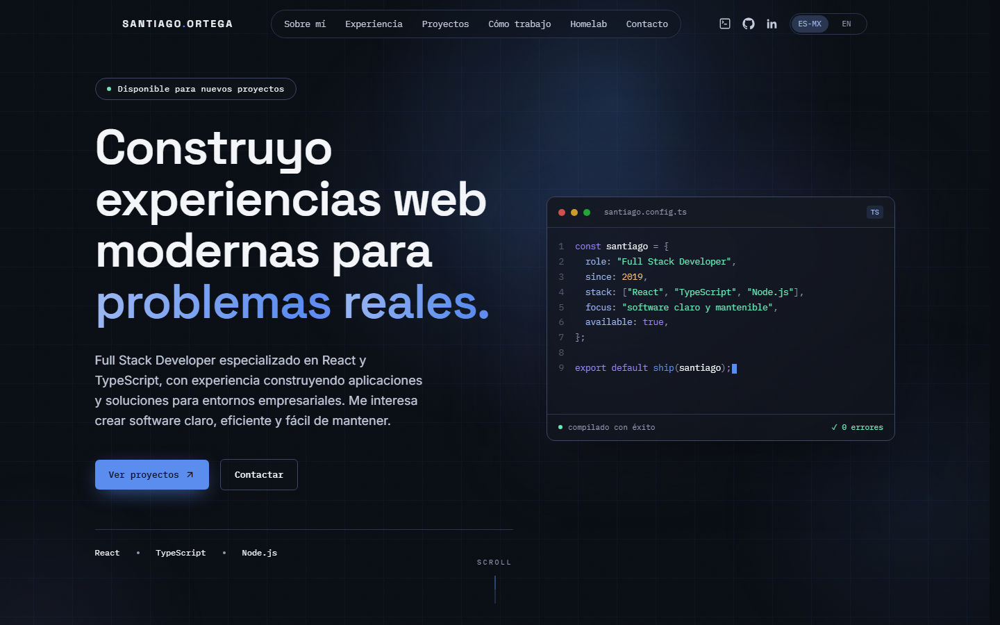

# Santiago Ortega · Portfolio

[](https://santiorteal.com)
[](https://github.com/SantiOrteal/santiago-portfolio/actions/workflows/ci.yml)
[](https://github.com/SantiOrteal/santiago-portfolio/actions/workflows/deploy.yml)

Personal portfolio of **Santiago Ortega**, Full Stack Developer (React · TypeScript · Node.js) based in Mexico.
Bilingual (🇲🇽 Spanish / 🇺🇸 English), built with React 19, Vite and Tailwind CSS v4, and deployed to Cloudflare Pages through GitHub Actions.

**→ [santiorteal.com](https://santiorteal.com)**



## Highlights

- **Motion with purpose**: word-by-word headline reveal, a self-typing code window, a cursor-following blueprint grid, spotlight cards, a scroll-driven experience timeline and magnetic buttons. Everything moves through `transform`/`opacity` and switches off under `prefers-reduced-motion`.
- **Hidden terminal** (<kbd>Ctrl</kbd>/<kbd>⌘</kbd> + <kbd>K</kbd>): `help`, `whoami`, `projects`, `goto contact`, `lang en`… with tab completion and command history. The command engine is a set of pure functions in [`src/lib/terminal.js`](src/lib/terminal.js).
- **Contact form with two delivery channels**: messages go to Web3Forms (email) and to an n8n workflow in my homelab (Telegram) in parallel; it succeeds if either one accepts. It has accessible validation, a honeypot and a `mailto:` fallback.
- **Project details in native `<dialog>` modals**: focus trap, <kbd>Esc</kbd>, focus restoration and a bottom sheet on phones.
- **Bilingual routing** (`/es-mx/`, `/en/`) with per-language SEO: canonical, `hreflang`, Open Graph, JSON-LD and a sitemap.
- **Accessible by default**: skip link, visible focus states, labelled controls, `aria-live` regions and keyboard-first interactions.
- **CI on every push and PR; deploys only on demand** (manual button or version tag).

## Tech stack

| Area | Tools |
|---|---|
| UI | React 19, Tailwind CSS v4, lucide-react |
| Build & lint | Vite 8, Oxlint |
| Hosting | Cloudflare Pages (`_redirects`, custom 404) |
| CI/CD | GitHub Actions + Wrangler |
| Contact | Web3Forms, n8n (self-hosted) |

## Getting started

Requires **Node.js 22** (or 20.19+).

```bash
git clone https://github.com/SantiOrteal/santiago-portfolio.git
cd santiago-portfolio
npm install
cp .env.example .env.local   # optional: enables the contact form channels
npm run dev
```

| Script | What it does |
|---|---|
| `npm run dev` | Development server with hot reload |
| `npm run build` | Production build into `dist/` |
| `npm run preview` | Serves the production build locally |
| `npm run lint` | Runs Oxlint |

### Environment variables

All of them are optional. Vite inlines them into the public bundle at build time, so **none of them is a secret**.

| Variable | Purpose |
|---|---|
| `VITE_SITE_URL` | Public origin for canonical, `hreflang` and JSON-LD URLs |
| `VITE_WEB3FORMS_KEY` | Web3Forms access key (email channel) |
| `VITE_N8N_WEBHOOK_URL` | Webhook URL for the second delivery channel |
| `VITE_N8N_WEBHOOK_TOKEN` | Optional shared value checked by the webhook |

## Project structure

```text
src/
├── components/      # One file per section + shared UI (modal, terminal, form)
├── context/         # Language provider (es-MX / en)
├── data/content.js  # All copy and data, both languages
├── hooks/           # Reveal on scroll, pointer effects, scroll spy, count-up
├── lib/             # Pure logic: terminal engine, message sending, helpers
└── index.css        # Theme tokens, animations and utilities
public/
├── _redirects       # SPA routes for Cloudflare Pages
├── 404.html         # Standalone not-found page
└── robots.txt, sitemap.xml
.github/workflows/   # ci.yml (checks) and deploy.yml (Cloudflare Pages)
docs/                # Deployment and contact-form guides
```

All text lives in [`src/data/content.js`](src/data/content.js), so the content can change without touching the components.

## Deployment

| Workflow | Runs on | Does |
|---|---|---|
| [`ci.yml`](.github/workflows/ci.yml) | Push to `master`, pull requests | `npm ci` → lint → build |
| [`deploy.yml`](.github/workflows/deploy.yml) | Manual button or `v*` tag | lint → build → `wrangler pages deploy` |

```bash
git tag v1.0.0
git push origin v1.0.0   # → builds and publishes to santiorteal.com
```

## License

[MIT](LICENSE) © Santiago Ortega

## Contact

- Website: [santiorteal.com](https://santiorteal.com)
- LinkedIn: [santiago-orteal](https://www.linkedin.com/in/santiago-orteal/)
- GitHub: [@SantiOrteal](https://github.com/SantiOrteal)

Or open the terminal on the site and type `contact`.
